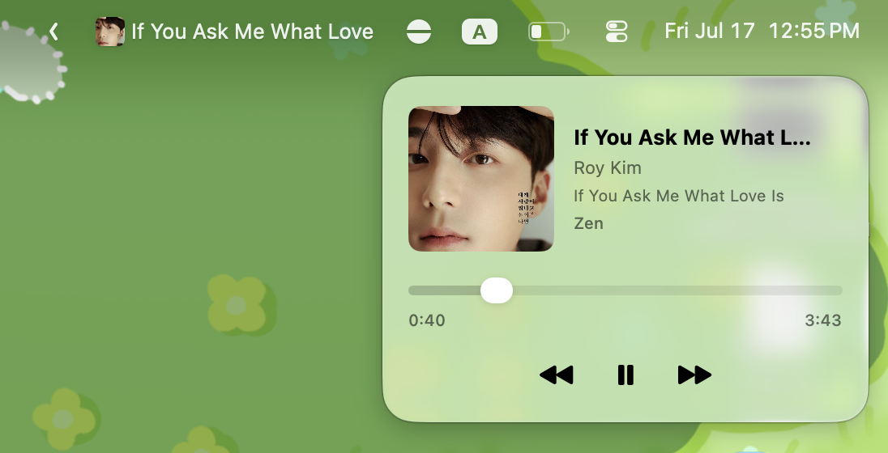

# NowPlayingBar 🎵

a tiny menu bar thing that shows what's currently playing on your mac. made this mostly because i wanted a cute song title display on my menu bar.

## what it does

- shows album art + song title in the menu bar
- click it → pretty glass popup with artwork, title, artist
- play / pause / skip buttons
- an actual seek bar you can drag
- launch at login toggle (right-click the menu bar item)

## screenshots

## why does this exist

> [!NOTE]
> written by claude. im lazy to write it

apple locked down the API that lets you read "now playing" info starting macOS 15.4 — only apple's own apps get to peek at it anymore 🙃. so this app cheats a little by shelling out to the system's perl interpreter (which does have permission) using [MediaRemoteAdapter](https://github.com/ejbills/mediaremote-adapter). playback controls (play/pause/skip) still worked fine the whole time, it's only the "what song is this" part that got blocked.

## requirements

- macOS 26 for the full glassy Liquid Glass look
- older macOS versions still work, frosted-glass included
- Xcode 16+ to build

## license

do whatever you want with this, it's a toy project, go nuts. it's The Unlicense ! make a patent bout it if you want :D
